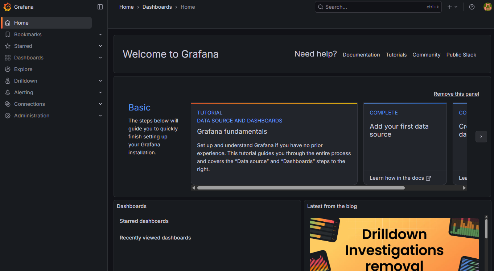
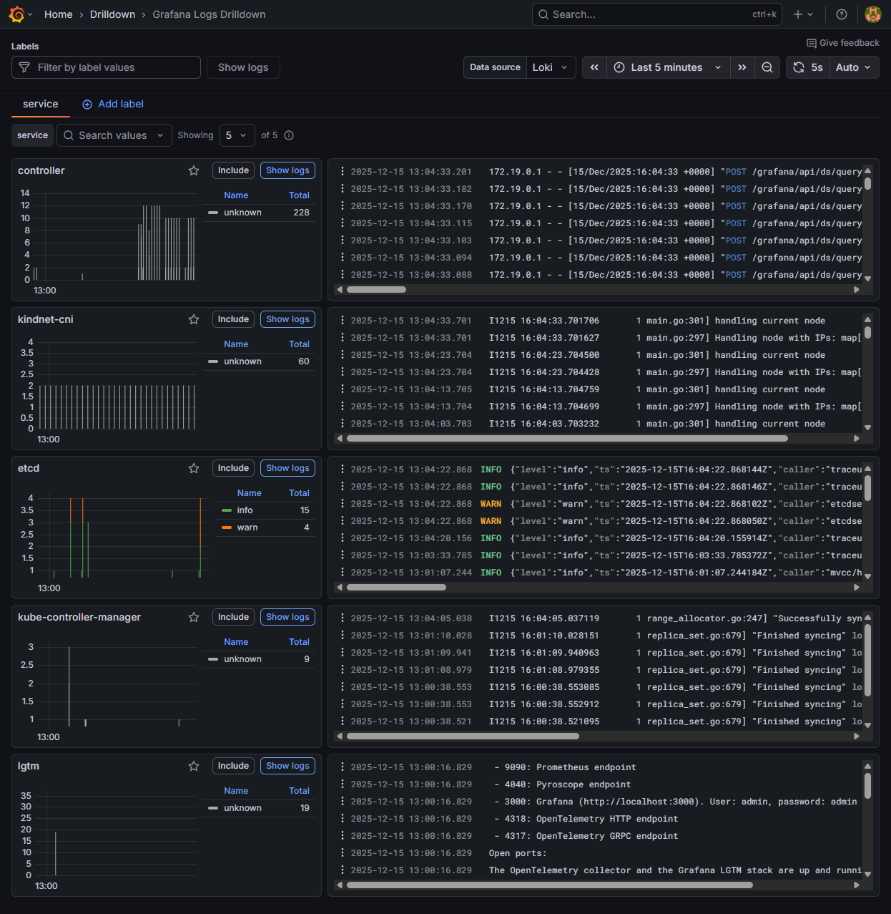
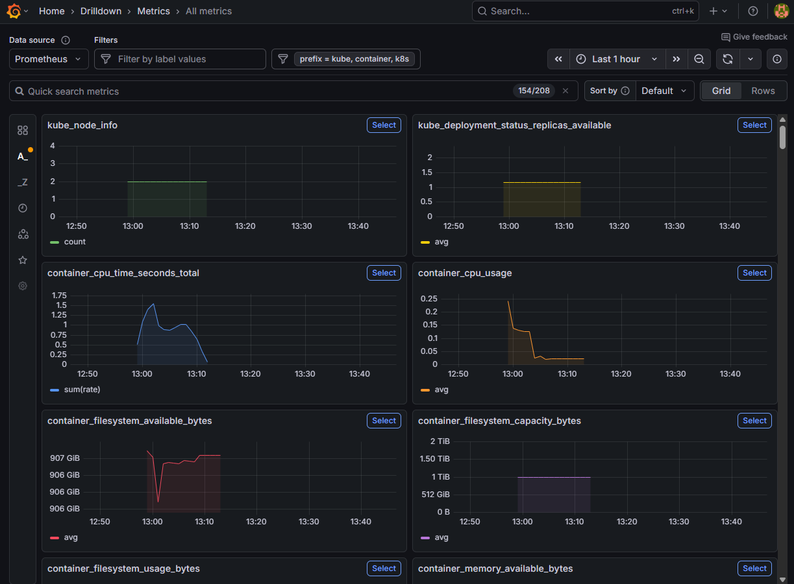
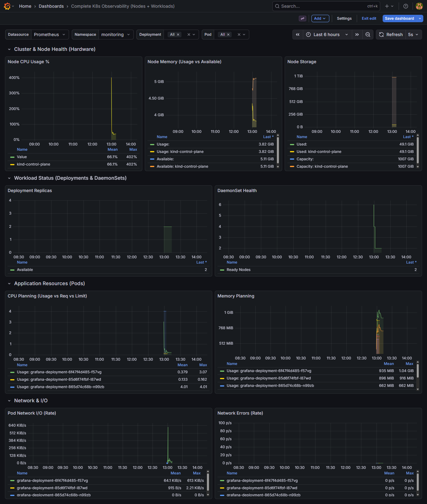
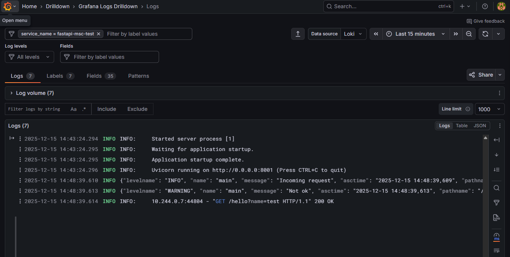
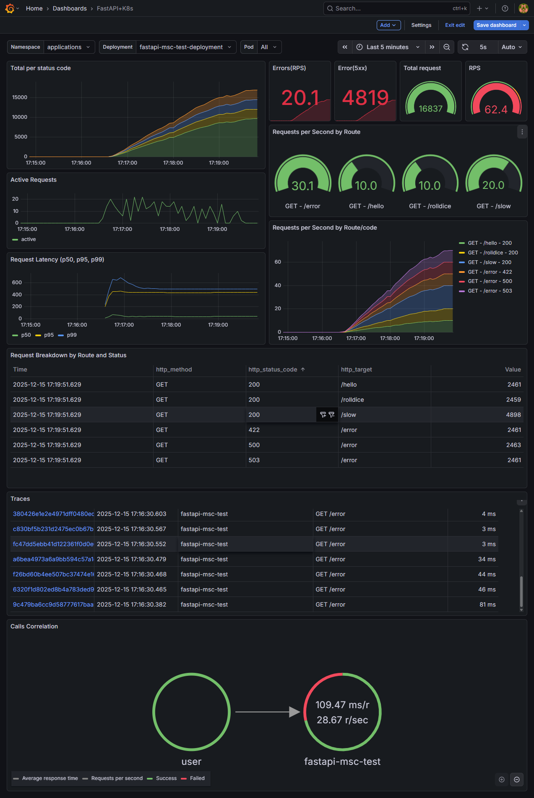

# Complete Monitoring & Instrumentation Stack

This repository provides a **full end‑to‑end monitoring, observability, and instrumentation environment** using Kubernetes (via KinD), OpenTelemetry, and the Grafana **LGTM stack** (Loki, Grafana, Tempo, Prometheus, OTEL Collector).

It also includes multiple **sample applications** (FastAPI, FastAPI + DB, Spring Boot, Apache Kafka, PostgreSQL) deployed on Kubernetes and fully observable through OTEL.

---

## 🚀 Overview

This project brings together:

* **KinD (Kubernetes-in-Docker)** for a lightweight local Kubernetes cluster.
* **Grafana OTEL LGTM stack** using the official `grafana/otel-lgtm:latest` Docker image.
* **OpenTelemetry (OTEL)** for metrics, logs, and traces.
* **Full set of sample microservices**:

    * FastAPI
    * FastAPI + PostgreSQL
    * Spring Boot
    * Apache Kafka
    * PostgreSQL database
* **Complete Kubernetes deployment configuration**:

    * Deployments
    * Services
    * Ingress
* **All microservices exposed via an Ingress Controller**.

The purpose is to demonstrate **complete monitoring, tracing, logging, metrics, and distributed observability** for modern microservices running in a real Kubernetes cluster.

---

## 🧱 Architecture

* **KinD cluster** hosts everything locally
* **Grafana OTEL LGTM** stack provides the following:

    * **Loki** → Logs
    * **Tempo** → Traces
    * **Prometheus** → Metrics
    * **OTEL Collector** → Receives and routes telemetry data
* Each application is fully instrumented using OTEL SDK or auto-instrumentation
* Telemetry is sent to the Collector → Prometheus / Tempo / Loki
* Grafana dashboards visualize all services
* Everything is deployed using standard Kubernetes YAML

Below is a conceptual overview of the observability stack in this repository.

                                User / Browser (http://www...)
                                                |
                                                |
    +-------------------------------------------|-----------------------------------+
    |  KUBERNETES CLUSTER                       v                                   |
    |                                 +---------------------+                       |
    |                                 |  Ingress Controller |                       |
    |                                 +----------+----------+                       |
    |                                            |                                  |         
    |             _______________________________|_______________                   |
    |             |                                             |                   |
    |             |                                             v                   | 
    |             |                      +---------------------------------------+  |
    |             |                      |  LGTM Stack (grafana/otel-lgtm)       |  |
    |             |                      |                                       |  |
    |             |                      |  +-----------+      +--------------+  |  |
    |             |                      |  | Grafana   |<---->| Prometheus   |  |  |
    |             |                      |  | UI        |<---->| Tempo        |  |  |
    |             v                      |  +-----------+      | Loki         |  |  |
    |  +------------------------+        |                     +-------^------+  |  |
    |  | Application Workloads  |        |                             |         |  |
    |  |                        |        |                      +------+-------+ |  |
    |  | [FastAPI] [SpringBoot] |        |                      | OTEL         | |  |
    |  | [Postgres] [Kafka]     |        |                      +------+-------+ |  |
    |  | [redis]   etc.         |        +--------+--------------------^---------+  |
    |  +----------+-------------+                                      |            |
    |             |                                                    |            |
    |             +----(OTLP Telemetry: Logs, Metrics, Traces)---------+            |
    |                                                                               |
    +-------------------------------------------------------------------------------+

---

## 📦 Included Sample Applications

- FastAPI: Basic Python API instrumented with OpenTelemetry. 
- FastAPI + PostgreSQL: API including database calls, demonstrating OTEL database instrumentation. 
- Spring Boot: A Java microservice using OTEL Java Agent for auto‑instrumentation.
- Apache Kafka: Kafka broker + producers/consumers instrumented for distributed tracing.
- PostgreSQL Database: Running in a container inside the cluster.
- Angular: Basic angular with OTEL instrumentation.

---

## ☸️ Kubernetes Resources

Each application includes:

* **Deployment** → containers, versions, env vars
* **Service** → internal service endpoints
* **Ingress** → external route via Ingress Controller

All services are accessible through a single ingress (e.g. `http://localhost/<service>`).

---

## 📊 Monitoring & Observability

All observability signals are enabled:

- 📈 Metrics: Collected via OTEL SDK / Collector and scraped by Prometheus.
- 📂 Logs: Collected using OTEL logging exporter and stored in Loki.
- 🔍 Traces: Distributed tracing using OTLP → Tempo.
- 🖥 Dashboards: Grafana provides (Application dashboards, Service maps, Trace waterfall views, Log aggregation views )

---

## 🧰 Requirements

* Docker - builds the application image
* KinD - runs a local Kubernetes cluster using Docker
* kubectl - manages and inspects Kubernetes resources
* Helm - deploys and manages complex applications on the cluster

---

## 📝 Purpose

This repository exists to provide a **complete, ready‑to‑use local observability lab**:

* Perfect for learning OTEL
* Testing distributed tracing
* Building dashboards
* Understanding Kubernetes observability patterns
* Experimenting with multiple languages and workloads

---

## 🧩 Folder Structure

```
# All projects contains theses files:
├── docker.sh       # Running container with docker only.
├── k8s.sh          # Docker build, load image into kind and run it into k8s
├── Dockerfile      # Dockerfile to build image with custom OTEL setup.
├── k8s.yaml        # K8s deployment/service/ingress config.
└── readme.md       # Readme.md extra line commands.

how-to-observability    # Root folder
│
├── fastapi-mfe-test    # Angular app with OTEL sdk
│
├── fastapi-msc-db      # FastAPI app with OTEL, Sqlalchemy, Postgres.
│   └── app/            # Python files, requirements etc.
│
├── fastapi-msc-kafka   # FastAPI app with OTEL, custom metric, Kafka.
│   ├── app/            # Python files, requirements etc.
│   └── test/           # Stress test Kafak and unit test.
│
├── fastapi-msc-test    # FastAPI app with OTEL, custom metric.
│   └── app/            # Python files, requirements etc.
│
├── java-msc-test       # Spring boot app with OTEL
│   ├── src/            # Source, controller, unit test etc.
│   ├── test/           # Stress test
│   └── opentelemetry-javaagent-1.32.0.jar # For instrumentation, there is other ways to do it using maven libs etc.
│
├── kafka               # Apache kafka
│   ├── config/         # Overwrite configs for kafka. 
│   └── otel_javaagent/ # Java Agent jar, custom kafka metris.
│
├── kind/               # Kind k8s locally
│   ├── kind-config.yaml# Custom kind cluster
│   └── config/         # Overwrite default configs (grafana, loki, otel, prometheus and tempo).
│
├── lgtm/               # Grafana+OTEL stack
│   ├── boards/         # Custom boards.
│   └── config/         # Overwrite default configs (grafana, loki, otel, prometheus and tempo).
│
├── postgresql/         # PostgresSQL 
│   ├── boards/         # Custom boards.
│   └── config/         # Overwrite default configs
│
├── .gitignore          
└──  readme.md
```
---

## 🔧 Setup Guide (Step-by-Step)

### 1️⃣ Create the KinD Cluster

https://kind.sigs.k8s.io/docs/user/quick-start/

```
# Creating kind cluster using custom config.
kind create cluster --config kind/kind-config.yaml
## After while, the cluster is created.
# run "kubectl get pods -ALL" you should get these pods running
kubectl get pods -ALL
NAMESPACE            NAME                                         READY   STATUS    RESTARTS   AGE  
kube-system          coredns-668d6bf9bc-9dcmg                     1/1     Running   0          47s   
kube-system          coredns-668d6bf9bc-g2ck6                     1/1     Running   0          47s
kube-system          etcd-kind-control-plane                      1/1     Running   0          52s
kube-system          kindnet-ttcz2                                1/1     Running   0          47s
kube-system          kube-apiserver-kind-control-plane            1/1     Running   0          52s
kube-system          kube-controller-manager-kind-control-plane   1/1     Running   0          52s
kube-system          kube-proxy-j6cdq                             1/1     Running   0          47s
kube-system          kube-scheduler-kind-control-plane            1/1     Running   0          52s
local-path-storage   local-path-provisioner-58cc7856b6-csxxx      1/1     Running   0          47s
```

In case any thouble delete and recreate the cluster
```
kind get clusters     
kind delete cluster
```

### Kubernetes System Pods Overview

This document explains the purpose of common system Pods found in a Kubernetes cluster, particularly in a **kind (Kubernetes in Docker)** environment.

### System Pods and Their Purpose

| Pod | Purpose |
|----|--------|
| `coredns` | Provides internal DNS and service discovery so Pods can resolve Services by name |
| `etcd` | Distributed key-value store that holds the entire cluster state |
| `kube-apiserver` | Entry point for all Kubernetes API requests (`kubectl`, controllers, schedulers) |
| `kube-controller-manager` | Runs control loops that reconcile desired state with actual state |
| `kube-scheduler` | Selects the most suitable Node for newly created Pods |
| `kube-proxy` | Implements Service networking and traffic routing to Pods |
| `kindnet` | CNI plugin responsible for Pod-to-Pod networking in kind clusters |
| `local-path-provisioner` | Dynamically provisions local PersistentVolumes for development clusters |

### Notes

- Most of these Pods run in the `kube-system` namespace.
- These components are critical for cluster operation and are usually managed automatically.
- In managed Kubernetes services (EKS, GKE, AKS), some of these components are hidden from users.
- `local-path-provisioner` is intended for **local development**, not production workloads.

### Mental Model

- **etcd** → Cluster memory
- **kube-apiserver** → API gateway
- **scheduler** → Placement decision-maker
- **controllers** → State reconciliation engines
- **kube-proxy / CNI** → Networking layer
- **CoreDNS** → Service name resolution

---

### 2️⃣ Install NGINX Ingress Controller

https://kind.sigs.k8s.io/docs/user/ingress/

```
# Install strainght from kind config using kubectl.
kubectl apply -f https://raw.githubusercontent.com/kubernetes/ingress-nginx/controller-v1.11.0/deploy/static/provider/kind/deploy.yaml

# After installed, Wait for it:
kubectl get pods -n ingress-nginx
NAME                                        READY   STATUS      RESTARTS   AGE
ingress-nginx-admission-create-th4m7        0/1     Completed   0          97s
ingress-nginx-admission-patch-cjlv4         0/1     Completed   2          97s
ingress-nginx-controller-77cdd96884-qcmb2   1/1     Running     0          97s
```

Just for clarification, below is the ingress-nginx using Helm (Kind-compatible).
- Chart version 4.11.0 corresponds to controller v1.11.0
- Ports 30080/30443 are commonly used with kind (adjust if needed publishService.enabled=false is required for kind)

```
# Or install via helm chart.
helm repo add ingress-nginx https://kubernetes.github.io/ingress-nginx
helm repo update

helm upgrade --install ingress-nginx ingress-nginx \
  --repo https://kubernetes.github.io/ingress-nginx \
  --namespace ingress-nginx --create-namespace \
  --set controller.service.type=NodePort \
  --set controller.service.nodePorts.http=30080 \
  --set controller.service.nodePorts.https=30443 \
  --set-string controller.nodeSelector.ingress-ready=true \
  --set controller.service.externalTrafficPolicy=Local \
  --set controller.watchIngressWithoutClass=true


# Check the instalation
helm list -n ingress-nginx

# You should see this
NAME            NAMESPACE       REVISION        UPDATED                                 STATUS          CHART                   APP VERSION
ingress-nginx   ingress-nginx   1               2026-01-03 16:13:13.955071 -0300 -03    deployed        ingress-nginx-4.11.0    1.11.0

# Check the pods     
kubectl get pods -n ingress-nginx
NAME                                      READY   STATUS    RESTARTS   AGE
ingress-nginx-controller-74477b76-v2zk5   1/1     Running   0          36s

# Uninstall in case any trouble and try again or use the kubectl option.
helm uninstall ingress-nginx -n ingress-nginx

```


Test http://localhost you should get "404 Not Found nginx" from nginx controller setup, which is ok.
Before we instrument k8s, let's deploy a simple FastAPI app with some endpoints and expose it via ingress controller.

### 3️⃣ Deploying LGTM (Grafana + OTEL)

https://grafana.com/docs/opentelemetry/docker-lgtm/

We are going to use this docker image 'grafana/otel-lgtm:0.12.0' which has all ini one, nice to run locally (not production setup):
```
OpenTelemetry collector => for receiving OpenTelemetry data.
Prometheus              => metrics database.
Tempo                   => trace database.
Loki                    => logs database.
Grafana                 => for visualization.
```
# LGTM Embedded Service Endpoints

The **grafana/otel-lgtm** container bundles multiple observability backends.  
Inside the container, each embedded service listens on the following local endpoints.

## Signal Endpoints

| Signal   | Backend      | Protocol        | Endpoint |
|----------|--------------|-----------------|----------|
| Traces   | Tempo        | OTLP HTTP       | `http://127.0.0.1:4318` |
| Traces   | Tempo        | OTLP gRPC       | `127.0.0.1:4317` |
| Metrics  | Prometheus   | OTLP HTTP       | `http://127.0.0.1:9090/api/v1/otlp` |
| Metrics  | Prometheus   | Remote Write    | `http://127.0.0.1:9090/api/v1/write` |
| Logs     | Loki         | OTLP HTTP       | `http://127.0.0.1:3100/otlp` |
| Profiles | Pyroscope    | OTLP gRPC       | `127.0.0.1:4040` |
| UI       | Grafana      | HTTP            | `http://127.0.0.1:3000` |


Building and deployment into k8s, at this moment we are not applying Otel custom configs yet.

```
# Building docker image and loading it into kind cluster
cd lgtm
docker build --no-cache --tag lgtm:1.0 .

# It may take some time given the image size.
kind load docker-image lgtm:1.0  

# Create a k8s namespace 'monitoring', it's important create namespace and keep things separated
kubectl create namespace monitoring

# Applying k8s configs (here we also ensure the namepsace creation in case it did not created yet).
kubectl apply -f k8s.yaml

# Verify if pod is runing, it can take some time, so wait for it.
kubectl get pods -n monitoring 
NAME                                  READY   STATUS    RESTARTS   AGE
grafana-deployment-8458dd4b69-k27x9   1/1     Running   0          15s
```
** In order to run all of this commands above once, there is k8s.sh script, but it's recommended run one by one first time for learning purpose.

Open browser at http://localhost/grafana (admim/admin) then you should see that:



So far we got running:

- K8s cluster running via Kind
- Ingress controller via Kind
- Grafana lgtm stack (Grafana, Tempo, Loki, Promehtues(Mimir built on) amd Open telemetry - Otel)

With all tools in place, let's instrument it all.

## There Two-level observability:

- Application observability → what happens within your code (business logic, requests, errors).
- Platform observability → what happens around your code (Kubernetes, network, resources, infrastructure).

You don't need to choose between instrumenting Kubernetes or an application;
ideally, you should combine both, each with a specific purpose.
- Logs - getting from k8s instrumentation straight from pods and send them via OTEL.
- Metrics/traces - getting from app via OTEL


## K8s Instrumentation

One of the best way to instrument Kubernetes (K8s) using OpenTelemetry (Otel) for collecting logs, traces, and metrics 
is by leveraging the OpenTelemetry Operator combined with the OpenTelemetry Collector.

This approach:
- Centralizes configuration
- Automates collection
- Separates the concerns of data collection from application code, which is ideal for a dynamic container environment like Kubernetes.

Let's clarify some understanding.

- Pods → write logs to stdout
- kind node → stores logs in /var/log/containers/*.log
- OTEL collects logs/metrics from Kind node.
- OTEL Sends logs to grafana/otel-lgtm → Loki

In order to get these info from K8s we will need install some packages:

* Cert-manager (Only if you want to enforce security data traffic via TLS etc)
* OpenTelemetry Operator (may need cert-manager or not)
* kube-state-metrics

By default, the OpenTelemetry Operator expects cert-manager to be present to issue certificates for its admission webhooks.

Add cert-manager later only if you need:
- Admission webhooks enabled
- mTLS between collectors
- Production-like security testing

### Do you need both (OpenTelemetry Operator and kube-state-metrics)?

Yes, in most real setups. They are **complementary**, not overlapping.

### Telemetry coverage

| Telemetry type              | OpenTelemetry Operator | kube-state-metrics |
|----------------------------|------------------------|--------------------|
| Application logs           | ✅                     | ❌                 |
| Application metrics        | ✅                     | ❌                 |
| Traces                     | ✅                     | ❌                 |
| Pod / Deployment state     | ⚠️ (indirect)          | ✅                 |
| HPA / rollout visibility   | ❌                     | ✅                 |
| Kubernetes metadata        | ❌                     | ✅                 |

- **OpenTelemetry Operator** → *How your applications behave*
- **kube-state-metrics** → *What Kubernetes is doing*

### Option 1 - Installing OpenTelemetry Operator with cert-manager

```
helm repo add jetstack https://charts.jetstack.io
helm repo update

helm install cert-manager jetstack/cert-manager \
  --namespace cert-manager \
  --create-namespace \
  --set installCRDs=true
```

Installing Opentelemetry Operator

```
# Add the Helm repository
helm repo add open-telemetry https://open-telemetry.github.io/opentelemetry-helm-charts
helm repo update

helm install otel-operator open-telemetry/opentelemetry-operator \
  --namespace opentelemetry-operator-system \
  --create-namespace
```

### Option 2 - Installing OpenTelemetry Operator (without Cert-manager)
```
# Add the Helm repository
helm repo add open-telemetry https://open-telemetry.github.io/opentelemetry-helm-charts
helm repo update

# Install wihtout cert-manager
helm install otel-operator open-telemetry/opentelemetry-operator \
  --namespace opentelemetry-operator-system \
  --create-namespace \
  --set admissionWebhooks.create=false \
  --set-string manager.env.ENABLE_WEBHOOKS=false
  
# In case any trouble uninstall and install again.
helm uninstall otel-operator -n opentelemetry-operator-system

# Verify the instalation
kubectl get pods -n opentelemetry-operator-system
NAME                                                    READY   STATUS    RESTARTS   AGE
otel-operator-opentelemetry-operator-7f55bcdbff-d4t5z   2/2     Running   0          23s
```

### Installing kube-state-metrics
```
# Adding repo  via Helm (recommend)
helm repo add prometheus-community https://prometheus-community.github.io/helm-charts
helm repo update

# Instalar kube-state-metrics
helm install ksm prometheus-community/kube-state-metrics \
--namespace kube-system \
--create-namespace

# Verify the instalations
kubectl get all -A -l app.kubernetes.io/name=kube-state-metrics
NAMESPACE     NAME                                         READY   STATUS    RESTARTS   AGE
kube-system   pod/ksm-kube-state-metrics-8c88554fd-4bvfb   1/1     Running   0          2m23s

NAMESPACE     NAME                             TYPE        CLUSTER-IP      EXTERNAL-IP   PORT(S)    AGE
kube-system   service/ksm-kube-state-metrics   ClusterIP   10.96.206.230   <none>        8080/TCP   2m23s

NAMESPACE     NAME                                     READY   UP-TO-DATE   AVAILABLE   AGE
kube-system   deployment.apps/ksm-kube-state-metrics   1/1     1            1           2m23s

NAMESPACE     NAME                                               DESIRED   CURRENT   READY   AGE
kube-system   replicaset.apps/ksm-kube-state-metrics-8c88554fd   1         1         1       2m23s
```

So far we have this setup

```
# List all recourses of k8s "kubectl get all -A"
NAMESPACE                       NAME                                                        READY   STATUS      RESTARTS       AGE
ingress-nginx                   pod/ingress-nginx-admission-create-57kj2                    0/1     Completed   0              3h16m
ingress-nginx                   pod/ingress-nginx-admission-patch-tmzsl                     0/1     Completed   2              3h16m
ingress-nginx                   pod/ingress-nginx-controller-77cdd96884-f2mqn               1/1     Running     0              3h16m
kube-system                     pod/coredns-668d6bf9bc-mgmxv                                1/1     Running     0              3h17m
kube-system                     pod/coredns-668d6bf9bc-xbx74                                1/1     Running     0              3h17m
kube-system                     pod/etcd-kind-control-plane                                 1/1     Running     0              3h17m
kube-system                     pod/kindnet-6ftmp                                           1/1     Running     0              3h17m
kube-system                     pod/ksm-kube-state-metrics-8c88554fd-4bvfb                  1/1     Running     0              3m22s
kube-system                     pod/kube-apiserver-kind-control-plane                       1/1     Running     0              3h17m
kube-system                     pod/kube-controller-manager-kind-control-plane              1/1     Running     2 (3h4m ago)   3h17m
kube-system                     pod/kube-proxy-jnv7t                                        1/1     Running     0              3h17m
kube-system                     pod/kube-scheduler-kind-control-plane                       1/1     Running     2 (3h5m ago)   3h17m
local-path-storage              pod/local-path-provisioner-58cc7856b6-gbffv                 1/1     Running     0              3h17m
monitoring                      pod/grafana-deployment-c7777965c-7r47z                      1/1     Running     0              162m
opentelemetry-operator-system   pod/otel-operator-opentelemetry-operator-7f55bcdbff-d4t5z   2/2     Running     0              57m

NAMESPACE                       NAME                                           TYPE        CLUSTER-IP      EXTERNAL-IP   PORT(S)                               AGE
default                         service/kubernetes                             ClusterIP   10.96.0.1       <none>        443/TCP                               3h17m
ingress-nginx                   service/ingress-nginx-controller               NodePort    10.96.185.100   <none>        80:30932/TCP,443:31094/TCP            3h16m
ingress-nginx                   service/ingress-nginx-controller-admission     ClusterIP   10.96.33.221    <none>        443/TCP                               3h16m
kube-system                     service/ksm-kube-state-metrics                 ClusterIP   10.96.206.230   <none>        8080/TCP                              3m22s
kube-system                     service/kube-dns                               ClusterIP   10.96.0.10      <none>        53/UDP,53/TCP,9153/TCP                3h17m
monitoring                      service/grafana-service                        ClusterIP   10.96.148.62    <none>        3000/TCP,4318/TCP,4317/TCP,9090/TCP   162m
opentelemetry-operator-system   service/otel-operator-opentelemetry-operator   ClusterIP   10.96.241.253   <none>        8443/TCP,8080/TCP                     57m

NAMESPACE     NAME                        DESIRED   CURRENT   READY   UP-TO-DATE   AVAILABLE   NODE SELECTOR            AGE
kube-system   daemonset.apps/kindnet      1         1         1       1            1           kubernetes.io/os=linux   3h17m
kube-system   daemonset.apps/kube-proxy   1         1         1       1            1           kubernetes.io/os=linux   3h17m

NAMESPACE                       NAME                                                   READY   UP-TO-DATE   AVAILABLE   AGE
ingress-nginx                   deployment.apps/ingress-nginx-controller               1/1     1            1           3h16m
kube-system                     deployment.apps/coredns                                2/2     2            2           3h17m
kube-system                     deployment.apps/ksm-kube-state-metrics                 1/1     1            1           3m22s
local-path-storage              deployment.apps/local-path-provisioner                 1/1     1            1           3h17m
monitoring                      deployment.apps/grafana-deployment                     1/1     1            1           162m
opentelemetry-operator-system   deployment.apps/otel-operator-opentelemetry-operator   1/1     1            1           57m

NAMESPACE                       NAME                                                              DESIRED   CURRENT   READY   AGE
ingress-nginx                   replicaset.apps/ingress-nginx-controller-77cdd96884               1         1         1       3h16m
kube-system                     replicaset.apps/coredns-668d6bf9bc                                2         2         2       3h17m
kube-system                     replicaset.apps/ksm-kube-state-metrics-8c88554fd                  1         1         1       3m22s
local-path-storage              replicaset.apps/local-path-provisioner-58cc7856b6                 1         1         1       3h17m
monitoring                      replicaset.apps/grafana-deployment-c7777965c                      1         1         1       162m
opentelemetry-operator-system   replicaset.apps/otel-operator-opentelemetry-operator-7f55bcdbff   1         1         1       57m

NAMESPACE       NAME                                       STATUS     COMPLETIONS   DURATION   AGE
ingress-nginx   job.batch/ingress-nginx-admission-create   Complete   1/1           48s        3h16m
ingress-nginx   job.batch/ingress-nginx-admission-patch    Complete   1/1           65s        3h16m
```

We got all the K8s instrumentation installed, now we need to set up Open telemetry to receiver and send traces/logs/metrics to grafana lgtm stack.

### Configuring Otel to receiver and send data to grafana lgtm stack.

Two ways to change/overwriting the otel default config inside of grafana/otel-lgtm image, you could do:

Via Docker file by overwriting the default file, but we need to build every time the docker image after any change.
```docker
COPY otel/otelcol-config-postgres.yaml /otel-lgtm/otelcol-config.yaml
``` 
Or via Configmap/service account which is a better way to apply it.
[config-map.yaml](lgtm/config/otel/otel-config-map.yaml) and [rbac-otel.yaml](lgtm/config/otel/rbac-otel.yaml)

Inside of [k8s.yaml](lgtm/k8s.yaml) uncomment or add this parts (spec.template.spec.serviceAccountName: lgtm-sa):
```
spec:
  replicas: 1
  selector:
    matchLabels:
      app: lgtm
  template:
    metadata:
      labels:
        app: lgtm
    spec:      
      serviceAccountName: lgtm-sa # --> K8s instrumentation, in order to work, a rbac rules must be apllied.
```

and this, in order to get logs/metrics/traces:
```
          env:
            # --- K8s instrumentation ---
            - name: NODE_NAME
              valueFrom:
                fieldRef:
                  fieldPath: spec.nodeName
            - name: K8S_NODE_NAME
              valueFrom:
                fieldRef:
                  fieldPath: spec.nodeName
            - name: K8S_CLUSTER_NAME
              value: "kind"  # Set your cluster name
```
Also this, remember we are running k8s locally inside of kind docker container, so all logs is inside of it.

```
          volumeMounts:
            # K8s instrumentation, getting logs from pdos.
            - name: varlogpods
              mountPath: /var/log/pods
              readOnly: true
            - name: varlibdockercontainers
              mountPath: /var/lib/docker/containers
              readOnly: true

             # container original files location where will be replaces via config map referenced on volumes.
            - name: otelcol-config
              mountPath: /otel-lgtm/otelcol-config.yaml
              subPath: otelcol-config.yaml

      volumes:
        # K8s instrumentation
        - name: varlogpods
          hostPath:
          path: /var/log/pods
        - name: varlibdockercontainers # Sometimes needed for symlinks
          hostPath:
          path: /var/lib/docker/containers

         # custom config of grafana lgtm that will be apply inside of container overwriting original file.
        - name: otelcol-config
          configMap:
            name: otelcol-config                 
```

What does it do?

- Create a service account, cluster rules in order to access k8s using rbac
- Overwriting the OTEL config to receive and send data to grafana lgtm (Loki, Tempo and Prometheus)

Let's applying the changes and restart the grafana deployment.
```
cd lgtm
# Apply config-map file
kubectl apply -f ./config/otel/otel-config-map.yaml

# Applying RBA rules in order to get permissions to access and read files.
kubectl apply -f ./config/otel/rbac-otel.yaml

# Re-apply k8s deployment configs again.
kubectl apply -f k8s.yaml

# restart the grafana deplyoment
kubectl rollout restart -n monitoring deployment grafana-deployment

# After while, verify it
kubectl get all,configmap -n monitoring
NAME                                      READY   STATUS        RESTARTS   AGE
pod/grafana-deployment-65cf7f99b-2wgqd    1/1     Terminating   0          39s
pod/grafana-deployment-756bdf5c65-8zz6c   1/1     Running       0          14s

NAME                      TYPE        CLUSTER-IP      EXTERNAL-IP   PORT(S)                               AGE
service/grafana-service   ClusterIP   10.96.189.170   <none>        3000/TCP,4318/TCP,4317/TCP,9090/TCP   15h

NAME                                 READY   UP-TO-DATE   AVAILABLE   AGE
deployment.apps/grafana-deployment   1/1     1            1           15h

NAME                                            DESIRED   CURRENT   READY   AGE
replicaset.apps/grafana-deployment-5586486895   0         0         0       15h
replicaset.apps/grafana-deployment-65cf7f99b    0         0         0       39s
replicaset.apps/grafana-deployment-756bdf5c65   1         1         1       14s

NAME                         DATA   AGE
configmap/kube-root-ca.crt   1      15h
configmap/otelcol-config     1      64s
```

Go to http://localhost/grafana/drilldown -> click logs, you see logs from k8s, sooner we deploy any app will be displayed as well.



Go to http://localhost/grafana/drilldown -> click metrics, you'll see metrics starting with k8s_*, kube_*, container_* etc.



Here a list of metrics you can play around and create your board [k8s-metrics.txt](lgtm/boards/k8s/k8s-metrics.txt)

Here is Cluster overview dashboard


Now it's time to instrument some apps

### Instrumenting FastAPI app using OTEL modules
we are going to use some of these modules below to instrument FastAPI apps, use it accordingly.
```
# Must have
opentelemetry-distro                            # Provides the OTEL SDK + API.
opentelemetry-exporter-otlp                     # Allows exporting through OTLP (HTTP/gRPC).
opentelemetry-instrumentation-logging           # This one injects trace_id and span_id into your logs automatically.

```
### Extra OTEL modules
- Do I need them? depends, if you run the auto instrumentation command like this "RUN opentelemetry-bootstrap -a=install" on dockerfile.
- These modules will be pick up automatically based on the main modules.
- For example, for `fastapi` the `opentelemetry-instrumentation-fastapi` will be installed and so on.
- So, should I add it? Unless we are not running the bootstrap command inside Dockerfile, yes, or even for organisation purpose.
```
opentelemetry-instrumentation-fastapi            # Auto-instruments FastAPI routes.
opentelemetry-instrumentation-asyncio            # Helps propagate OTEL context between asyncio tasks — recommended but not required.
opentelemetry-instrumentation-aiohttp-client     # Auto-instruments aiohttp client calls.
opentelemetry-instrumentation-requests           # Auto-instruments the requests library.
opentelemetry-instrumentation-httpx              # Auto-instruments HTTPX (sync/async).
opentelemetry-instrumentation-grpc               # Auto-instruments gRPC client/server.
opentelemetry-instrumentation-aiokafka           # Auto-instruments aiokafka producer/consumer automatically.
opentelemetry-instrumentation-sqlalchemy         # Auto-instruments SQL queries executed by SQLAlchemy.
opentelemetry-instrumentation-asyncpg            # Auto-instruments raw asyncpg queries.
opentelemetry-instrumentation-psycopg2           # Auto-instruments PostgreSQL calls using psycopg2 (sync).
opentelemetry-instrumentation-redis              # Auto-instruments Redis client operations.
```

### Auto instrumentation via Dockerfile
If you check [Dockerfile](fastapi-msc-test/Dockerfile) you will some ENV that set up the auto-instrument using OTEL.

```docker
# Core environment variables for OpenTelemetry
ENV OTEL_SERVICE_NAME=fastapi-msc-test \
    OTEL_RESOURCE_ATTRIBUTES="service.version=1.0,deployment.environment=development,team=my-team" \
    OTEL_EXPORTER_OTLP_COMPRESSION=gzip \
    OTEL_EXPORTER_OTLP_INSECURE=true \
    OTEL_EXPORTER_OTLP_ENDPOINT=grafana-service.monitoring.svc.cluster.local:4317 \
    OTEL_LOGS_EXPORTER=none \
    OTEL_PYTHON_FASTAPI_EXCLUDED_URLS="health,metrics,healthz" \
    OTEL_TRACES_SAMPLER=parentbased_traceidratio \
    OTEL_TRACES_SAMPLER_ARG=0.05 \
    OTEL_METRIC_EXPORT_INTERVAL=15000 \
    OTEL_METRIC_EXPORT_TIMEOUT=5000
```

** Remember, we are not sending logs, because we already have it via k8s instrumentation.

### There is a plenty of option for the OTEL core, and for specifics stacks.

[OTEL - Core](https://opentelemetry.io/docs/specs/otel/configuration/sdk-environment-variables)<br>
[OTEL - Python](https://opentelemetry.io/docs/zero-code/python/configuration)<br>
[OTEL - Java](https://opentelemetry.io/docs/zero-code/java/)<br>
[OTEL - Js](https://opentelemetry.io/docs/zero-code/js/)

### Deploy Sample Applications "[fastapi-msc-test](fastapi-msc-test)"

```
# Let's build the docker image and deploy it into k8s
cd fastapi-msc-test
docker build --no-cache  --tag fastapi-msc-test:1.0 .

#Load docker image into Kind cluster
kind load docker-image fastapi-msc-test:1.0
 
# For all application we need create a k8s namespace, otherwise it's use default which is not good, just run it once.
kubectl create namespace applications

# Apply k8s.yaml that has deployment/service/ingress route
kubectl apply -f k8s.yaml

# check if pod is running
kubectl get -n applications pods 
NAME                                          READY   STATUS        RESTARTS   AGE
fastapi-msc-test-deployment-f5747c55f-btppl   1/1     Running       0          30s

# Extras command in case you want check the logs or restart the deployment
kubectl logs -n applications deployments/fastapi-msc-test-deployment
kubectl rollout restart -n applications deployment fastapi-msc-test-deployment

# test using curl 
curl http://localhost/fastapi/hello?name=John
{"hello":"test"} 

curl --location 'http://localhost/fastapi/rolldice?player=test'
{"result": "5"}

curl --location 'http://localhost/fastapi/error?code=422'
{
"error_type": "Directly Passed Status Code",
"requested_status_code": 422
}
```
Here is logs via k8s instrumentation of FastAPI app test.




OK, we got k8s running, first app running, grafana, working through ingress controller, instrumentation, so far so good. ✅

### 6️⃣ Let's create a dashboard for a FastAPI app.

The main metrics to monitor are:
- Total request per status code
- Total request
- RPS (sum)
- Active Requests
- RPS by Route
- Request Latency (p50, p95, p99)
- RPS by Route/code
- Request Breakdown by Route and Status
- Traces
- Calls Correlation

Playing around as your needs.

📊 FastAPI Board



This board can be found here [fastapi-k8s-board.json](lgtm/boards/fastapi/fastapi-k8s-board.json)

## More instrumentation samples

 - Angular instrumentation [fastapi-mfe-test](fastapi-mfe-test)
 - FastAPI + PostgreSQL [fastapi-msc-db](fastapi-msc-db)
 - FastAPI + Kafka [fastapi-msc-kafka](fastapi-msc-kafka)
 - Spring boot (java) [java-msc-test](java-msc-test)
 - Kafka Cluster [kafka](kafka)
 - Postgresql [postgresql](postgresql)
 - K8s [k8s](k8s)
---

## 🧪 Load Testing Examples

You can use `hey` or `k6` to generate traffic.

Example with `hey`:

```
hey -n 20000 -c 100 \
  -m POST \
  -H "Content-Type: application/json" \
  -d '{"key":"user1","value":"hello world"}' \
  http://localhost/api/produce
```

---

## 🛠 Troubleshooting

### Not seeing traces?

* Check OTEL Collector endpoint in your apps
* Verify kube-dns is working
* Ensure OTLP exporters are configured

### Not seeing logs?

* Verify Loki is running
* Ensure OTEL logger provider is enabled

### Not seeing metrics?

* Confirm Prometheus scraping config
* Ensure OTEL metrics exporter is active

---

## ❤️ Contributions

Feel free to open PRs for:

* new sample apps
* new dashboards
* new observability experiments

---

Enjoy the setup and happy observability! 🎉 🚀
