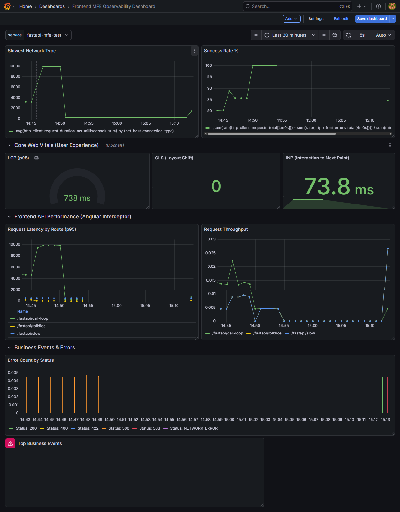
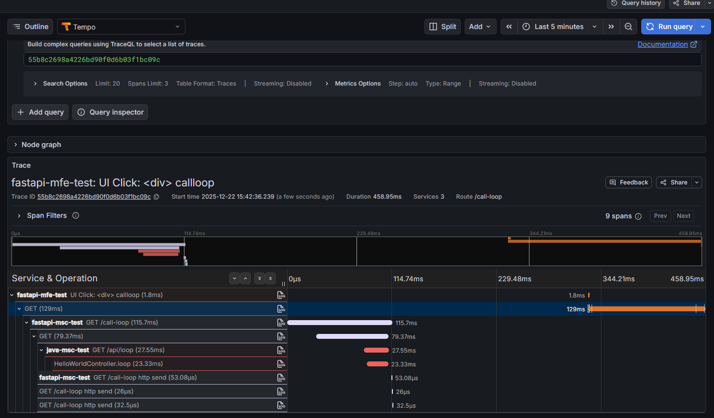

# Angular + OpenTelemetry (OTel) sdk

Sample production-oriented overview of using OpenTelemetry (OTel) 
with an Angular application, focused on browser tracing and metrics. This assumes Angular 15+ and a standard SPA deployment.

### What OpenTelemetry Covers in Angular (Browser)

Signals

- Traces: Page loads, route changes, XHR/fetch calls, user interactions.
- Metrics (optional): Web vitals and custom measurements (still maturing in browsers).
- Logs: Typically handled separately; OTel browser logging support is limited.

### Scope

- Frontend telemetry complements backend telemetry (FastAPI, Node, etc.) via distributed tracing using context propagation headers.
---

## Recommended Architecture

OTel SDK (browser) initialized early (before Angular bootstrap).
Auto-instrumentations for:
- fetch / XMLHttpRequest
- Document load
- User interactions

OTLP HTTP exporter sending traces to:
- An OTel Collector (recommended), or
- A vendor endpoint (Datadog, New Relic, Grafana Tempo, etc.).

CORS + headers aligned with backend for trace continuity.


## OTEL dependencies

```js
  "@opentelemetry/api": "1.9.0",
  "@opentelemetry/auto-instrumentations-web": "0.41.0",
  "@opentelemetry/exporter-metrics-otlp-http": "0.53.0",
  "@opentelemetry/exporter-trace-otlp-http": "0.53.0",
  "@opentelemetry/instrumentation": "0.53.0",
  "@opentelemetry/propagator-b3": "1.26.0",
  "@opentelemetry/resources": "1.26.0",
  "@opentelemetry/sdk-metrics": "1.26.0",
  "@opentelemetry/sdk-trace-web": "1.26.0",
  "@opentelemetry/semantic-conventions": "1.27.0",
```
### Instrument setup

- This file must be imported before Angular bootstraps [instrument.ts](src/instrument.ts)
- Import before Angular bootstrap [main.ts](src/main.ts)
- Otel intercep for custom metrics [otel-http.interceptor.ts](src/app/otel-http.interceptor.ts)

### Backend Correlation (Critical)

To enable end-to-end traces:
Backend must:
- Accept traceparent / baggage headers.
- Be instrumented with OTel.

CORS must allow:
- Access-Control-Allow-Headers: traceparent, baggage

### Known Limitations

- No automatic error stack symbolication (use source maps + vendor tooling).
- Metrics support in browsers is limited compared to backend SDKs.
- Sampling must be carefully tuned to avoid excess client telemetry.

### Best Practices

- Always send telemetry to an OTel Collector, not directly to vendors.
- Use sampling (e.g., 10–20%) on the frontend.
- Avoid capturing PII in spans or attributes.
- Align service.name and environment tags with backend services.

---

## Docker 

```dockerfile
# Building docker image
docker build --tag fastapi-mfe-test:1.0 .

# Running docker image
docker run --name fastapi-mfe-test -p 4200:4200 fastapi-mfe-test:1.0

# Stoping container 
docker container stop fastapi-mfe-test

# Removing container
docker container remove fastapi-mfe-test

# Removing docker image
docker image remove fastapi-mfe-test:1.0
```
---

## Kind
```
# Loading docker image into kind cluster
kind load docker-image fastapi-mfe-test:1.0
```

---
## Kubectl (k8s)
```
# Applying k8s configs
kubectl apply -f k8s.yaml

# Checking the pods status
kubectl get pods -n applications
kubectl get pods -n applications | grep fastapi-mfe-test

# Logging
kubectl logs -n applications deployments/fastapi-mfe-test-deployment -f

# List service
kubectl get svc -n applications | grep fastapi-mfe

# Forwarding port for tests directly to k8s service
kubectl port-forward svc/fastapi-mfe-test-service 4200:4200 -n applications

# Restarting deploymenty 
kubectl rollout restart deployment fastapi-mfe-test-deployment -n applications

# Deleting k8s deployment 
kubectl delete -n applications deployments.apps fastapi-mfe-test-deployment
```
---
## Grafana 

MFE Board 



Tracing over div click with correlection to backend services.

