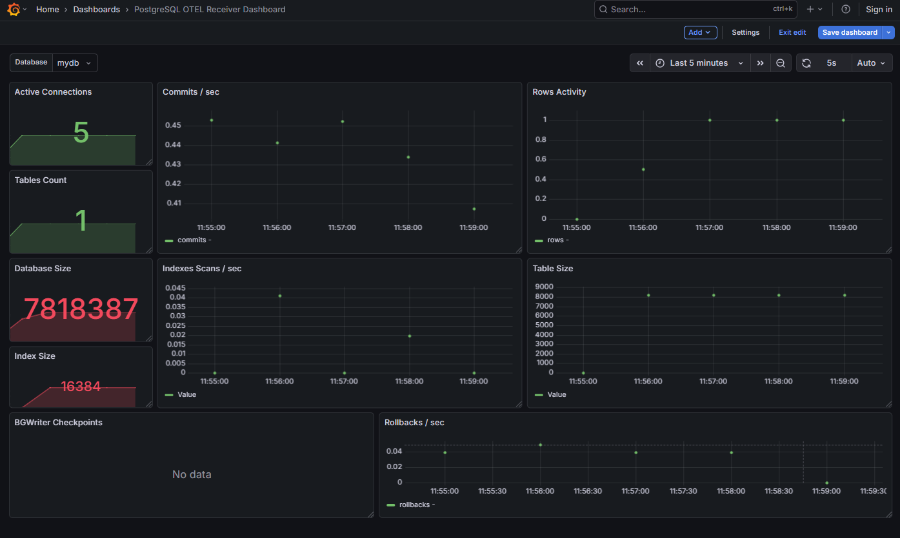
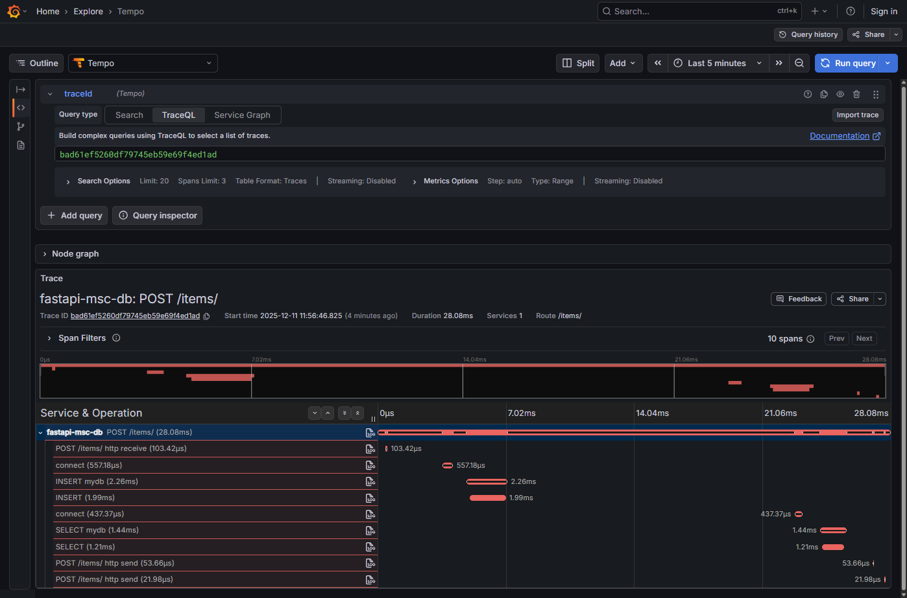
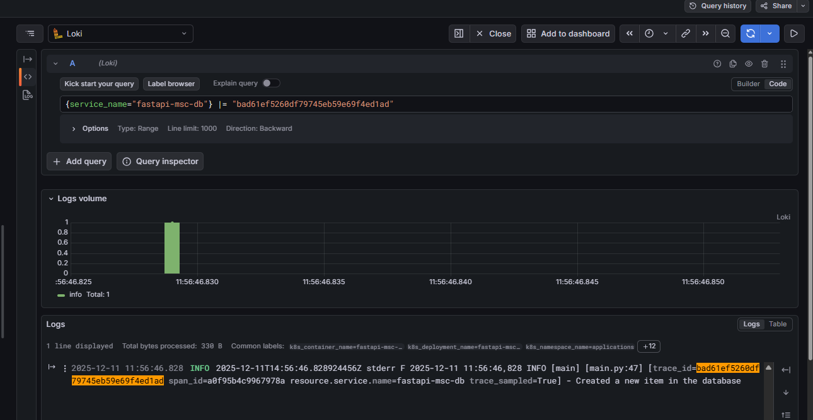

# FastAPI + Postgresql

Sample production-oriented overview of using OpenTelemetry (OTel) with FastAPI accessing postgresql, focused on tracing and metrics.


## OTEL dependencies

```py
opentelemetry-distro
opentelemetry-exporter-otlp
opentelemetry-instrumentation-fastapi

```

Auto instrumentation via Dockerfile [Dockerfile](Dockerfile)

---

## Docker 

```dockerfile
# Building docker image
docker build --tag fastapi-msc-db:1.0 .

# Running docker image
docker run --name fastapi-msc-db -p 8001:8001 fastapi-msc-db:1.0

# Stoping container 
docker container stop fastapi-msc-db

# Removing container
docker container remove fastapi-msc-db

# Removing docker image
docker image remove fastapi-msc-db:1.0
```
---

## Kind
```
# Loading docker image into kind cluster
kind load docker-image fastapi-msc-db:1.0
```

---
## Kubectl (k8s)
```
# Applying k8s configs
kubectl apply -f k8s.yaml

# Checking the pods status
kubectl get pods -n applications
kubectl get pods -n applications | grep fastapi-msc-db

# Logging
kubectl logs -n applications deployments/fastapi-msc-db-deployment -f

# List service
kubectl get svc -n applications | grep fastapi-mfe

# Forwarding port for tests directly to k8s service
kubectl port-forward svc/fastapi-msc-db-service 8001:8001 -n applications

# Restarting deploymenty 
kubectl rollout restart deployment fastapi-msc-db-deployment -n applications

# Deleting k8s deployment 
kubectl delete -n applications deployments.apps fastapi-msc-db-deployment
```
---
## Grafana 

DB Board



Trace on insert



logging correlating with trace id.


