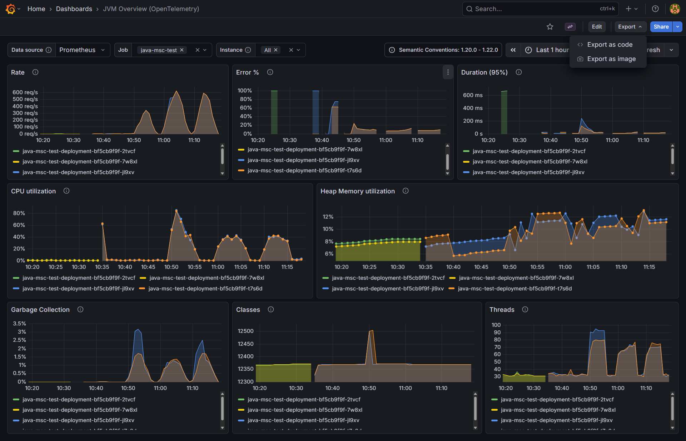
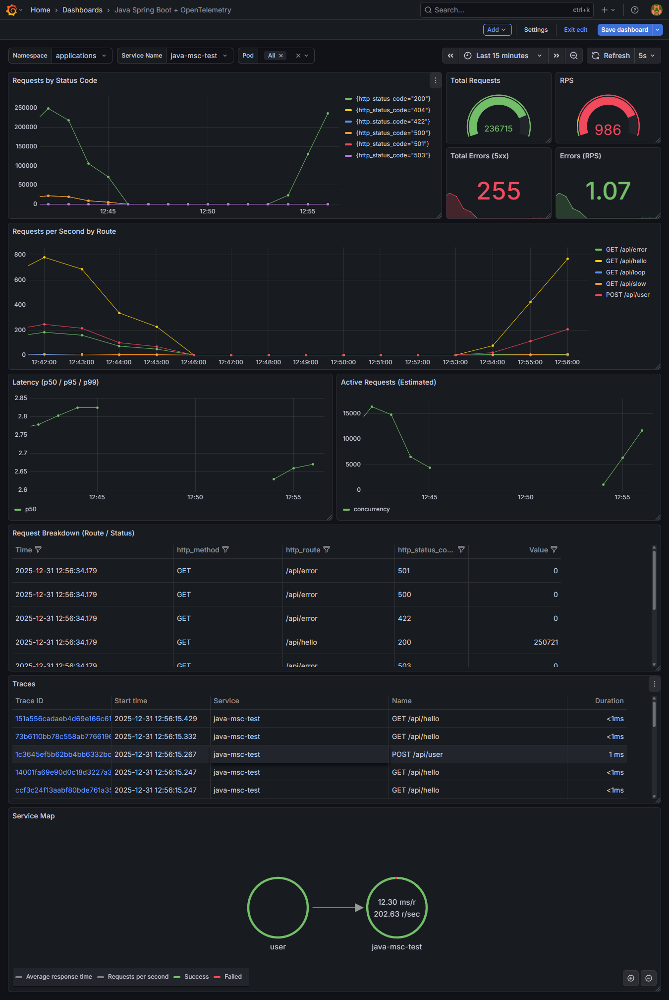

# Spring boot (Java)

Sample production-oriented overview of using OpenTelemetry (OTel), focused on tracing and metrics.


## OTEL dependencies

The opentelemetry-javaagent is a standalone JAR file that provides zero-code instrumentation for Java applications. It allows you to collect traces, metrics, and logs from your application and its libraries (like Spring Boot, JDBC, Kafka, etc.) without having to modify a single line of your source code.

It works by attaching to the Java Virtual Machine (JVM) at startup and dynamically injecting bytecode into the classes as they load.

[opentelemetry-javaagent-1.32.0.jar](opentelemetry-javaagent-1.32.0.jar)


Auto instrumentation via Dockerfile [Dockerfile](Dockerfile)

## OpenTelemetry Java Agent vs Spring Actuator (Micrometer)

| Feature | OpenTelemetry Java Agent | Spring Actuator (Micrometer) |
|--------|--------------------------|-------------------------------|
| **Data Flow** | **Push-based:** The agent sends data directly to a collector or backend. | **Pull-based:** A server (like Prometheus) must *scrape* your app’s URL. |
| **Instrumentation** | **Zero-code:** Uses bytecode injection at runtime. No code changes needed. | **Library-based:** Requires dependencies in your `pom.xml` or `build.gradle`. |
| **Scope** | Captures spans, metrics, and logs across the entire JVM and all libraries. | Primarily captures metrics and health for the Spring Framework ecosystem. |
| **Distributed Tracing** | Included out-of-the-box (automatic context propagation). | Requires `micrometer-tracing` and extra configuration to work. |
| **Configuration** | Managed via JVM args (`-javaagent`) and environment variables. | Managed via `application.properties` or `application.yml`. |
| **Use Case** | Best for end-to-end observability and vendor neutrality. | Best for simple health checks and local Prometheus monitoring. |


---

## Docker

```dockerfile
# Building docker image
docker build --tag java-msc-test:1.0 .

# Running docker image
docker run --name java-msc-test -p 8001:8001 java-msc-test:1.0

# Stoping container 
docker container stop java-msc-test

# Removing container
docker container remove java-msc-test

# Removing docker image
docker image remove java-msc-test:1.0
```
---

## Kind
```
# Loading docker image into kind cluster
kind load docker-image java-msc-test:1.0
```

---
## Kubectl (k8s)
```
# Applying k8s configs
kubectl apply -f k8s.yaml

# Checking the pods status
kubectl get pods -n applications
kubectl get pods -n applications | grep java-msc-test

# Logging
kubectl logs -n applications deployments/java-msc-test-deployment -f

# List service
kubectl get svc -n applications | grep fastapi-mfe

# Forwarding port for tests directly to k8s service
kubectl port-forward svc/java-msc-test-service 8001:8001 -n applications

# Restarting deploymenty 
kubectl rollout restart deployment java-msc-test-deployment -n applications

# Deleting k8s deployment 
kubectl delete -n applications deployments.apps java-msc-test-deployment
```
---

## Grafana

JVM Board [jvm-overview-board.json](../lgtm/boards/java/jvm-overview-board.json)



Spring boot board [spring-boot-borad.json](../lgtm/boards/java/spring-boot-borad.json)




