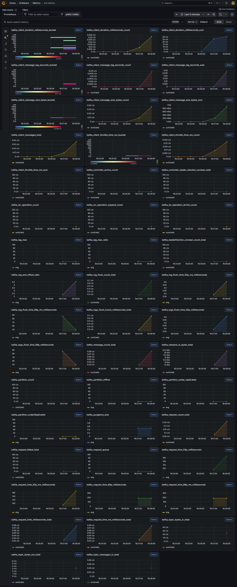
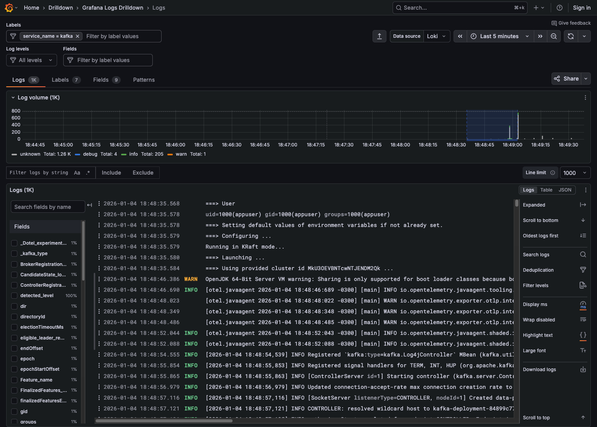
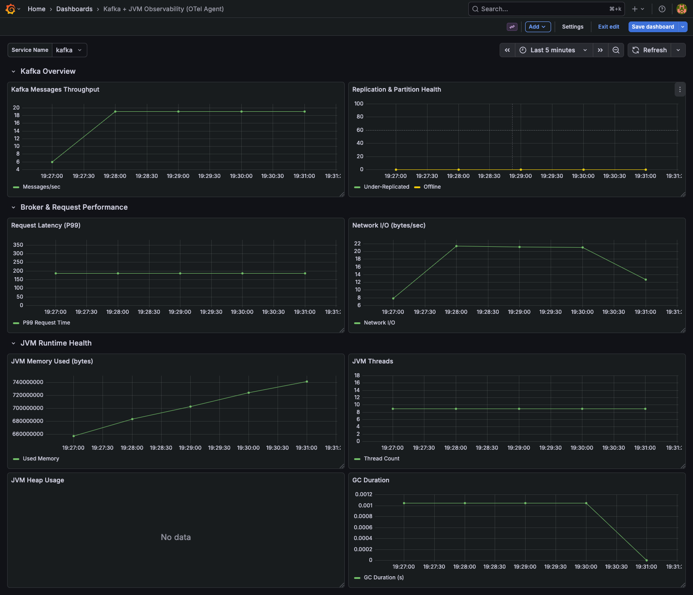

# Kafka Instrumentation via JMX agent

Kafka instrumentation via a JMX agent is the standard, production-grade approach to extract broker, JVM, and internal Kafka metrics and export them to observability backends such as Prometheus, OpenTelemetry, Datadog, or Elastic.

---

## OTEL + Java agent

### How it works?
```
# Execution model
Kafka JVM
└─ JMX MBeans
    └─ OpenTelemetry Java Agent (JMX metrics)
        └─ OTLP
            └─ OpenTelemetry Collector
                └─ Prometheus / Grafana / Datadog / Elastic
```

** No JMX RMI ports are exposed. Metrics are collected in-process, then exported via OTLP. **

### Supported Kafka Components

Using java agent + JMX, you can instrument:
- Kafka brokers
- Kafka controllers
- Kafka Connect
- Kafka Streams
- Schema Registry (Confluent)
- JVM (GC, memory, threads)
  
### Required Components

- OpenTelemetry Java Agent
- JMX metric configuration (YAML)
- OpenTelemetry Collector

### Otel config

- Java Agent [opentelemetry-javaagent.jar](otel_javaagent/opentelemetry-javaagent.jar)
- Kafka custom metrics [kafka-custom-1.yaml](otel_javaagent/kafka-custom-1.yaml)
- Auto instrumentation via Dockerfile [Dockerfile](Dockerfile)

---

## Docker

```dockerfile
# Building docker image
docker build --tag kafka:1.0 .

# Running docker image
docker run --name kafka -p 8001:8001 kafka:1.0

# Stoping container 
docker container stop kafka

# Removing container
docker container remove kafka

# Removing docker image
docker image remove kafka:1.0

```
---

## Kind
```
# Loading docker image into kind cluster
kind load docker-image kafka:1.0
```

---
## Kubectl (k8s)
```
# Applying k8s configs
kubectl apply -f k8s.yaml

# Checking the pods status
kubectl get pods -n applications
kubectl get pods -n applications | grep kafka

# Logging
kubectl logs -n applications deployments/kafka-deployment -f

# List service
kubectl get svc -n applications | grep fastapi-mfe

# Forwarding port for tests directly to k8s service
kubectl port-forward svc/kafka-service 8001:8001 -n applications

# Restarting deploymenty 
kubectl rollout restart deployment kafka-deployment -n applications

# Deleting k8s deployment 
kubectl delete -n applications deployments.apps kafka-deployment
```
---

## Extras

```
#kafka config files path
/opt/kafka/config
```

```
# Changing quotas for force thtottle.
docker exec -e JAVA_TOOL_OPTIONS='-Dotel.javaagent.enabled=false' -e KAFKA_OPTS='' kafka /opt/kafka/bin/kafka-configs.sh \
--bootstrap-server localhost:9092 \
--alter --add-config 'producer_byte_rate=100,consumer_byte_rate=100' \
--entity-type clients --entity-default

# k8s
kubectl exec -it -n applications deployment/kafka-deployment -- /opt/kafka/bin/kafka-configs.sh \
--bootstrap-server kafka-service:9092 \
--alter --add-config 'producer_byte_rate=100,consumer_byte_rate=100' \
--entity-type clients --entity-default
```

```
# list metrics inside docker container
docker exec -u 0 kafka sh -c "\
    wget -qO /tmp/jmxterm.jar https://repo1.maven.org/maven2/org/cyclopsgroup/jmxterm/1.0.4/jmxterm-1.0.4-uber.jar && \
    echo 'beans' | java -cp /tmp/jmxterm.jar org.cyclopsgroup.jmxterm.boot.CliMain -l localhost:9101 -n"
    
# k8s
kubectl exec -it deployment/kafka-deployment -n applications -- sh -c "\
    wget -qO /tmp/jmxterm.jar https://repo1.maven.org/maven2/org/cyclopsgroup/jmxterm/1.0.4/jmxterm-1.0.4-uber.jar && \
    echo 'beans' | java -cp /tmp/jmxterm.jar org.cyclopsgroup.jmxterm.boot.CliMain -l localhost:9101 -n"    
```

```
# logs throttle 
docker exec -e KAFKA_OPTS='' kafka /opt/kafka/bin/kafka-configs.sh --bootstrap-server localhost:9092 --alter --add-config 'producer_byte_rate=1000,consumer_byte_rate=1000' --entity-type clients --entity-default
docker exec kafka tail -f /opt/kafka/logs/server.log | grep -i throttle
```

---

## Grafana

Metrics



Logs



Grafana Kafka cluster board



Board kafka + Topic

