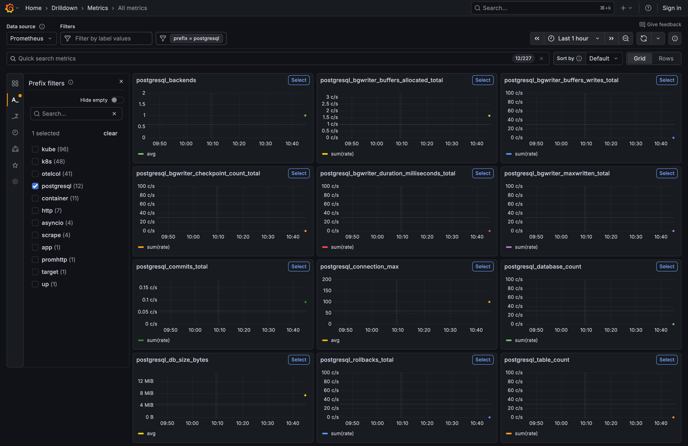
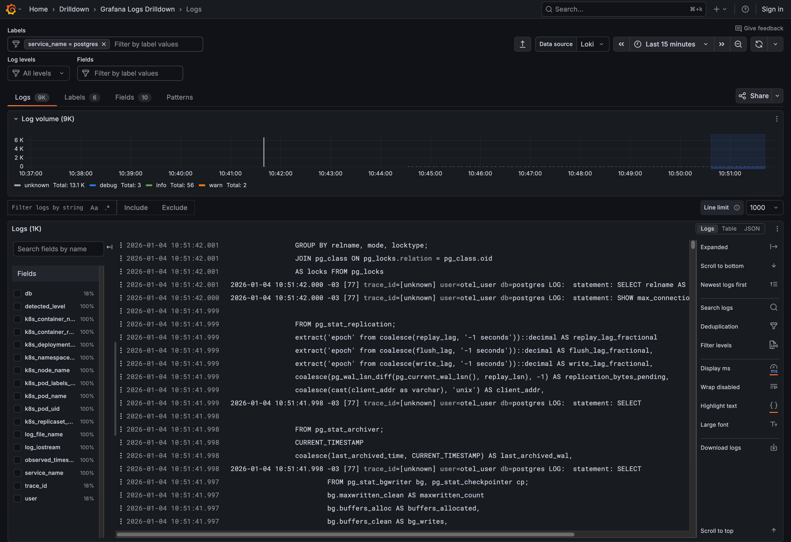
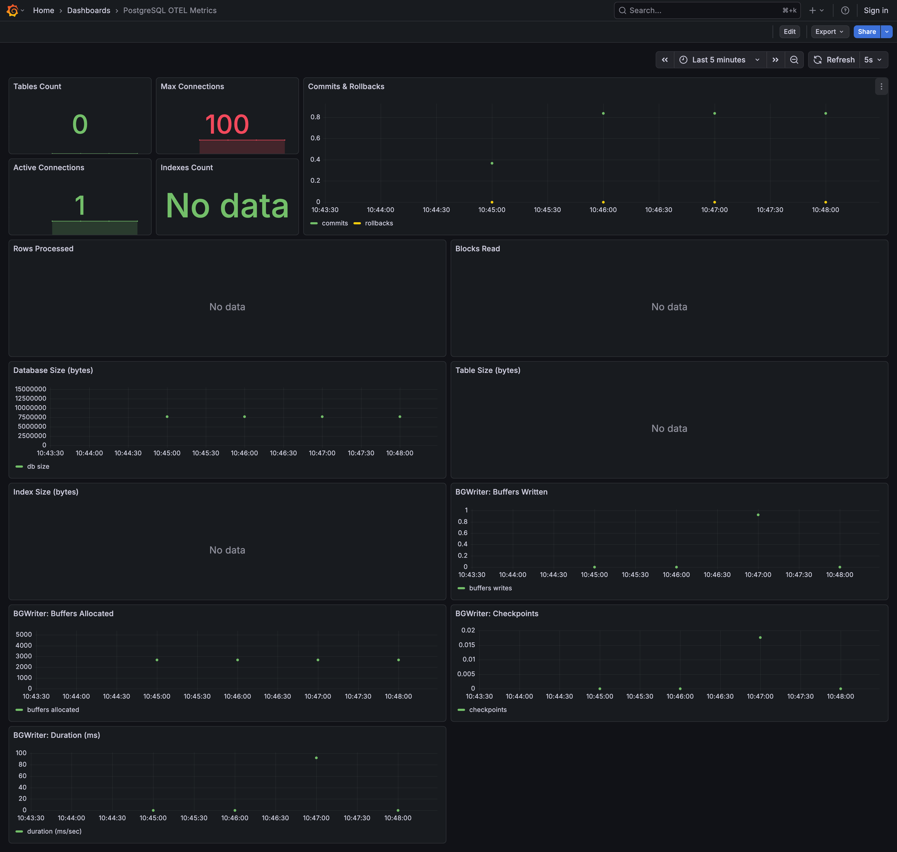

# PostgresSQL + OpenTelemetry (OTel) 

Sample production-oriented overview of using OpenTelemetry (OTel) 
with an PostgresSQL database, focused on browser tracing and metrics.

Instrumenting PostgreSQL with OpenTelemetry (OTel) typically involves two different "sides" of the equation: 
- Infrastructure Monitoring (getting metrics from the database itself) 
- Application Instrumentation (tracing the queries your code sends to the database).

---

## OTEL instumentantion

### Infrastructure: Monitoring the Database (Metrics)

To get metrics like connection counts, disk I/O, and query throughput, you use the OpenTelemetry Collector with the PostgreSQL Receiver.

- Step A: Prepare PostgreSQL
You need a user with permissions to read statistics. It is best practice to use the built-in pg_monitor role.

```SQL
CREATE USER otel_user WITH PASSWORD 'your_password';
GRANT pg_monitor TO otel_user;
```

- Step B: Configure the OTel Collector
In your config.yaml for the Collector, add the postgresql receiver.

```yaml
 - /var/lib/postgresql/data/log/*.log # postgresql logs

receivers:
  postgresql:
    endpoint: localhost:5432
    transport: tcp
    username: otel_user
    password: ${env:POSTGRES_PASSWORD}
    databases:
      - my_app_db
    collection_interval: 10s

service:
  pipelines:
    metrics:
      receivers: [postgresql]
      exporters: [otlp] # Or your preferred backend (e.g., Prometheus, Datadog)
```

You can check this config at [otel-config-map.yaml](../lgtm/config/otel/otel-config-map.yaml) make the changes and uncomment as you need.

### Application: Tracing Database Calls (Traces)

To see how long a specific SELECT or INSERT takes within your application's request flow, you must instrument your database driver. This is usually "zero-code" or "low-code" depending on your language.

Python (Psycopg2)
Install the instrumentation package: pip install opentelemetry-instrumentation-psycopg2.

```python
from opentelemetry.instrumentation.psycopg2 import Psycopg2Instrumentor
import psycopg2

# Now use the library as normal
conn = psycopg2.connect(database="my_app_db")
...
```

### Logging Configurations

Here is a breakdown of those configurations. These are essential for turning PostgreSQL into a transparent data source for OpenTelemetry and your observability stack.

### 🛠 Core Logging Configuration

| Parameter | Recommended Value | Description | Why OTel Needs It |
| :--- | :--- | :--- | :--- |
| **log_destination** | `stderr` | Where logs are sent. | Allows OTel to scrape logs from container streams. |
| **logging_collector** | `on` | Background capture. | Ensures reliable log delivery during high traffic. |
| **log_statement** | `all` | SQL command logging. | Provides a full audit trail of queries executed. |
| **log_min_duration** | `300ms` | Slow query filter. | Captures bottlenecks for performance analysis. |

### 🔗 Correlation & Performance

| Parameter | Recommended Value | Purpose | Trace Correlation Logic |
| :--- | :--- | :--- | :--- |
| **log_line_prefix** | `'%m [%p] trace_id=%a '` | Log formatting. | `%a` captures the Trace ID from the app. |
| **shared_preload** | `pg_stat_statements` | Stats module. | **Required** for query-level performance metrics. |
---

We are going to changes thisproperties at [postgresql.conf.sample](config/postgresql.conf.sample) and overwriting via Dockerfile.

After make all the changes, build docker image, load it into kin, deploy on k8s, you must apply k8s config on grafana again and restart it.

## Docker 

```dockerfile
# Building docker image
docker build --tag postgresql:1.0 .

# Running docker image
docker run --name postgresql -p 4200:4200 postgresql:1.0

# Stoping container 
docker container stop postgresql

# Removing container
docker container remove postgresql

# Removing docker image
docker image remove postgresql:1.0
```
---

## Kind
```
# Loading docker image into kind cluster
kind load docker-image postgresql:1.0
```

---
## Kubectl (k8s)
```
# Applying k8s configs
kubectl apply -f k8s.yaml

# Checking the pods status
kubectl get pods -n datastore
kubectl get pods -n datastore | grep postgresql

# Logging
kubectl logs -n datastore deployments/postgresql-deployment -f

# List service
kubectl get svc -n datastore | grep fastapi-mfe

# Forwarding port for tests directly to k8s service
kubectl port-forward svc/postgresql-service 4200:4200 -n datastore

# Restarting deploymenty 
kubectl rollout restart deployment postgresql-deployment -n datastore

# Deleting k8s deployment 
kubectl delete -n datastore deployments.apps postgresql-deployment
```
---
## Grafana 

Metrics



Logs



Board - DataBase - General

